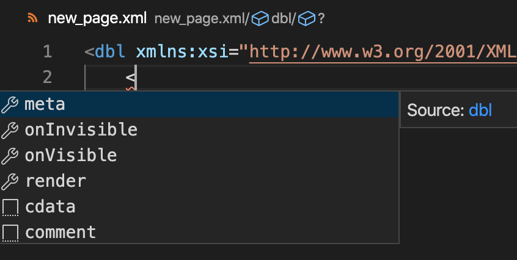

### 原生开发环境

Android或iOS

### 工程集成

#### Android

- 引入最新DreamBox版本

##### 1.  在 AndroidStudio 中，项目工程的 build.gradle 文件中引入依赖仓储
````
allprojects {
    repositories {
        maven {
            mavenCentral()
        }
    }
}
````

##### 2.  在对应模块的 build.gradle 中增加依赖即可
````
dependencies {
    api 'com.didiglobal.carmate:dreambox:0.3.1'
}
````


#### iOS

- 增加DreamBox依赖

##### 1.  使用Cocoapods，在PodFile中增加DreamBox依赖

````
pod 'DreamBox_iOS', :git => 'https://github.com/didi/DreamBox/core-ios'
````
##### 2.  直接使用代码依赖，直接把Classes文件夹加到工程即可。DreamBox本身依赖MJExtension 和SDWebImage

````
  pod 'MJExtension',
  pod 'SDWebImage' , 
````

### DSL开发环境

- Visual Studio Code 并安装XML(Redhat) 扩展
- 或其他支持XSD校验的IDE

开发步骤：
1. 创建一个`xml`文件
2. 键入内容
   ```xml
   <dbl xmlns:xsi="http://www.w3.org/2001/XMLSchema-instance" xsi:noNamespaceSchemaLocation="https://db-xsd.oss-cn-beijing.aliyuncs.com/dbl.xsd">
   </dbl>
   ```
   暂时通过XSD达成自动补全效果，DB的各种DSL在快速迭代开发中，XSD多有更新不及时的情况
   
3. 验证自动补全效果
   
4. 具体DSL书写内容参考[DSL开发手册](../dsl/changelog.md)


### 安装CLI

> 需要Python3的运行环境

本地终端执行`pip3 install dmb-cli`，安装成功后命令行执行`dmb-cli`，若看到如下内容则安装成功：
```
> dmb-cli -v
DreamBox CLI Version: 3.1.10 , for RUNTIME: 0.3
```

#### 更新CLI
```
pip3 install --upgrade dmb-cli
```

> 更多关于CLI的使用说明参见[命令行工具使用说明](cli/README.md)